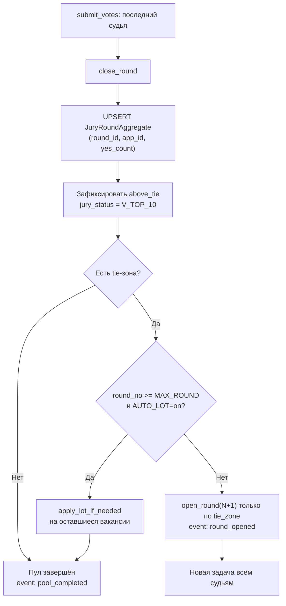

## Контекст

Сейчас `JURY_ROUNDS=3` зашит в [app/config.py](app/config.py) (строки 122–129) и через него в [app/services/jury.py](app/services/jury.py) (`close_round` → `needs_next = is_tied and round_no < JURY_ROUNDS`, строки 537/574/594, плюс маппинг 581–585). Шорт-лист собирается только в финале (`_finalize_pool` 739–823) и применяет жребий безусловно при `is_tied`. Хранилище голосов в [app/database/models.py](app/database/models.py) 324–326 — три фиксированные колонки + поле 26 «итоговый раунд». Excel-реестр ([app/services/registry.py](app/services/registry.py) 372–374) тоже выводит ровно эти три колонки. Лист «Голосование жюри» уже динамический по числу раундов и менять его не нужно.

Поведение «когда последний судья отправил оценки — автозакрытие раунда + автооткрытие следующего» уже работает: [app/services/jury.py](app/services/jury.py) 511–516 (`submit_votes`) + 622–635 (`close_round`). Перестраивать триггер не надо — только снять верхнюю границу и сделать поведение управляемым.

## Архитектура после изменений



## Изменения по файлам

### 1. Настройки (новое + правки)

- [app/config.py](app/config.py): заменить `JURY_ROUNDS` на `JURY_MAX_ROUND_DEFAULT` (default `3`) и добавить `JURY_AUTO_LOT_DEFAULT` (default `True`). `JURY_ROUNDS` удалить.
- Новый `app/services/jury_settings.py` по образцу [app/services/intake_mode.py](app/services/intake_mode.py): ключи `app_settings.jury_max_round` (int) и `app_settings.jury_auto_lot` (`on`/`off`). API: `get_jury_max_round()`, `get_jury_auto_lot()`, `set_jury_max_round(int)`, `set_jury_auto_lot(bool)`. Кэш в памяти + reset на set, как в `intake_mode`.

### 2. Хранилище голосов

- [app/database/models.py](app/database/models.py): удалить `jury_round1_yes`, `jury_round2_yes`, `jury_round3_yes` (строки 324–326). Оставить `jury_final_round`, `jury_decided_by_lot`, `pool_position`.
- Новый класс `JuryRoundAggregate`:

```python
class JuryRoundAggregate(Base):
    __tablename__ = "jury_round_aggregates"
    __table_args__ = (
        UniqueConstraint("round_id", "application_id", name="uq_jra_round_app"),
    )
    id: Mapped[PyUUID] = mapped_column(UUID(as_uuid=True), primary_key=True, default=uuid.uuid4)
    round_id: Mapped[PyUUID] = mapped_column(ForeignKey("jury_rounds.id", ondelete="CASCADE"))
    application_id: Mapped[PyUUID] = mapped_column(ForeignKey("applications.id", ondelete="CASCADE"))
    yes_count: Mapped[int] = mapped_column(Integer, nullable=False, default=0)
```

- [app/database/migrations.py](app/database/migrations.py): добавить миграцию — `CREATE TABLE jury_round_aggregates`, перенос данных из старых колонок (`INSERT … SELECT id, jury_round{N}_yes` по каждому раунду), затем `ALTER TABLE applications DROP COLUMN jury_round{1,2,3}_yes`.

### 3. Логика жюри (главное)

В [app/services/jury.py](app/services/jury.py):

- Удалить `from config import JURY_ROUNDS`, читать `max_round = await get_jury_max_round()` и `auto_lot = await get_jury_auto_lot()` в `close_round`.
- `close_round` (524–637):
  - Вместо обновления `Application.jury_roundN_yes` (581–592) — UPSERT в `JuryRoundAggregate(round_id, app_id, yes_count)`.
  - **Новое:** после `_compute_round_outcome` — сразу фиксировать `above_tie_ids` как `jury_status=V_TOP_10`, `jury_final_round=round_obj.round_no`, `pool_position=…`. Список заявок пула, помеченных `НА_ГОЛОСОВАНИИ`, но не попавших в above_tie и не входящих в tie-зону → `NE_VOSHLO_V_TOP_10` (отсев тех, кто не прошёл по голосам).
  - Решение «нужен ли следующий раунд»:
    - если `outcome.is_tied=False` и `top_ids` уже заполнили вакансии — пул завершён, событие `pool_completed`;
    - если `is_tied=True`:
      - если `round_no >= max_round` и `auto_lot=True` → `apply_lot_if_needed` + событие `lot_applied`;
      - иначе → `open_round(round_no + 1)` только с tie-зоной как кандидатами (above_tie уже зафиксирован), событие `round_opened`. Лимита сверху нет, если `auto_lot=False`.
- `apply_lot_if_needed` (670–731): пересчитать `remaining = TOP_N - (уже_зафиксированных_в_top10_пуле)`, не полагаясь на `outcome.above_tie_ids` текущего раунда (в инкрементальной модели above_tie прошлых раундов уже в БД).
- `_finalize_pool` (739–823): сильно упростить — теперь это «добить пул прямо сейчас» для `/jury_finalize`. Если есть открытый раунд — закрыть его (через `close_round` → инкрементальная фиксация); если осталась tie-зона и `auto_lot=False` — НЕ применять жребий, оставить вакансии пустыми (для частичного шорт-листа).
- `build_shortlist` (826–871): вернуть все `Application.jury_status == V_TOP_10`, упорядоченные по `(track, age_category, pool_position)`. Жребий и фиксация уже выполнены в `close_round`/`_finalize_pool` — здесь только чтение.

### 4. Хендлеры админа

- Новый `app/handlers/admin_jury_settings.py`:
  - `/admin_jury_settings` — показывает текущие `max_round` и `auto_lot`, плюс кнопки «Изменить порог», «Включить/выключить жребий».
  - FSM `AdminFlow.JURY_MAX_ROUND_INPUT` для ввода числа (валидация: 1..50).
  - Тумблер `auto_lot` — кнопкой без ввода.
  - Регистрация коллектора в [app/handlers/\_\_init\_\_.py](app/handlers/__init__.py).
- [app/handlers/admin.py](app/handlers/admin.py) и [app/keyboards.py](app/keyboards.py): добавить пункт «Настройки жюри» в `admin_main_menu_bubbles` / `admin_system_menu_bubbles`.
- [app/handlers/moderator_jury_admin.py](app/handlers/moderator_jury_admin.py): `/jury_state` дополнительно печатает строку «Порог жюри: N раундов · жребий: вкл/выкл».

### 5. Реестр Excel

- [app/services/registry.py](app/services/registry.py) 372–375: заменить три ячейки на одну колонку «Голоса по раундам» формата `r1:7, r2:5, r3:3, r4:2` (склейка из `JuryRoundAggregate` по `app_id`). Колонка 26 (`jury_final_round`) остаётся. Загрузка агрегатов — одним SELECT с `GROUP BY application_id`/индексированием в памяти (без N+1).
- Если есть `docs/registry-spec.md` — обновить описание колонок 23–26.

### 6. Уведомления

- [app/services/notifications.py](app/services/notifications.py): добавить новое событие `pool_completed` в `notify_moderation_chat_jury_event` (шаблон: «Пул `<pool>` завершён: топ-10 определён в раунде N (жребий: нет)»). Использовать индивидуально, без агрегации.
- Шаблон `LOT_APPLIED_TEMPLATE` оставить, но он будет триггериться только если `auto_lot=True`.

### 7. ТЗ и журнал

- [docs/history/ТЗ.md](docs/history/ТЗ.md):
  - §35.1 (строки 1451–1458): «до 3 раундов» → «до `JURY_MAX_ROUND` раундов (по умолчанию 3); при `JURY_AUTO_LOT=off` раунды продолжаются до полного разрешения ничьи».
  - §35.2 (1460–1480): переписать модель — после каждого закрытого раунда above_tie фиксируется сразу в топ-N, в следующий раунд уходит только tie-зона (новая задача всем судьям). «Альтернативные настройки» (1477) переписать под runtime-управление.
  - §35.5 (1536–1558): «процесс по пулу завершается в одном из раундов» → инкрементальная фиксация; «формирование Excel-шорт-листа» — после события `pool_completed` по всем 9 пулам.
  - §27.5 / §27.1: добавить `/admin_jury_settings`.
  - Новый журнал §36.6 «снятие лимита раундов, инкрементальный шорт-лист».

### 8. Тесты

- Расширить `tests/test_jury_algorithm.py`:
  - сценарий 5 раундов с `auto_lot=off`;
  - инкрементальная фиксация above_tie (после раунда 2 уже есть `V_TOP_10`-заявки);
  - `auto_lot=on` + `max_round=3` — лот срабатывает на 3-м раунде;
  - `apply_lot_if_needed` корректно учитывает already-fixed места.
- Новый `tests/test_jury_settings.py` — runtime-управление, кэш, дефолты.

## Точки внимания

- Миграция данных из `jury_round{1,2,3}_yes` в `JuryRoundAggregate` должна пройти **до** удаления колонок (две отдельные миграции в `run_auto_migrations`).
- В `close_round` важно сделать всё атомарно: подсчёт + UPSERT агрегата + фиксация above_tie в одной сессии, до открытия следующего раунда. Идемпотентность `UPDATE … WHERE status=OPEN` (552–559) уже защищает от двойного закрытия.
- `JuryStatus.NE_VOSHLO_V_TOP_10` теперь проставляется **по мере закрытия раундов** (тех, кто выбыл), а не одним финальным аккордом — это меняет момент уведомлений участникам. Проверить, что `services.notifications` не шлёт это до конца пула (нужно ли промежуточно — отдельный вопрос, по умолчанию: только после `pool_completed`).